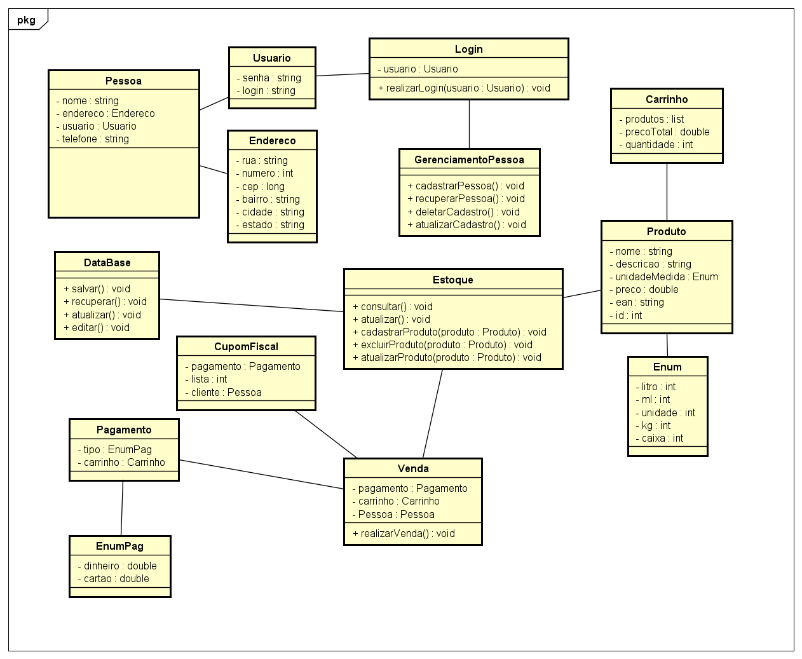

# Projeto Lógica de Programação Orientada a Objetos

Projeto como requisito para aprovação na disciplina do curso de ADS do IFPE Campus Garanhuns.

## Como contribuir:

  1. Realize um fork do repositório clicando no ícone correspondente localizado no canto superior direito; 
  
  2. Faça uma cópia local do projeto utilizando umas das seguintes sugestões:
            
            
        Clique em `Code` depois copie a URL da aba HTTPS.
        
        2.1 - No GitBash dentro da pasta de sua preferência execute o comando: 
        `git clone <COLAR>`
        
          Na IDE Eclipse Abra o projeto localizado na pasta escolhida acima.
        
        2.2 - Na IDE Eclipse acesse:
          
          
                file -> import -> Git -> Projects from GIT (with smart import) -> Clone URI -> next -> 
                
                URI (Cole a URI que foi copiada) -> next (master) -> next Remote name: origin -> next
                
                -> Finish
                
                            
  3. Adicione a referência ao reposítorio 'principal' do pojeto utilizando:
  
    git remote add upstream https://github.com/jjunio01/projeto-ads.git
    
 4 . Sincronizando as bases:
 
    Procedimento deve ser realizado antes de qualquer contribuição no projeto:
      
      4.1 - Baixar o código do repositório principal: ( git fetch upstream )
      4.2 - Mude para o branch que deseja sincronizar: ( git checkout master )
      4.3 - Faça um rebase entre os repositórios :  ( git rebase upstream/master ) 
      4.4 - Sincronizando os repositórios local e remoto: (git push origin master)
      
      
5. Crie um branch para realizar suas contribuições:

    `git checkout -b <NOME DO BRANCH>`
  
      Após ter feito as modificações necessárias faça:
      
        git add . (Para colocar na esteira dos os arquivos modificados e adicionados)
      
        git commit -m"Escreva um resumo do que foi feito"
      
        git push origin <NOME DO BRANCH>
      
        No GitHub vá em New pull request

### Diagrama de Classes
  

## Colaboradores:
  - [@Edreyl16](https://github.com/Edreyl16) Edrey Lucas dos Anjos Augusto
  - [@jjunio01](https://github.com/jjunio01) Jose Junio Araujo da Silva  
  - [@mikaelbr073](https://github.com/Mikaelbr073) Mikael Carvalho de Barros
  - [@PettersonDouglas](https://github.com/PettersonDouglas) Petterson Douglas Ataíde Silva
